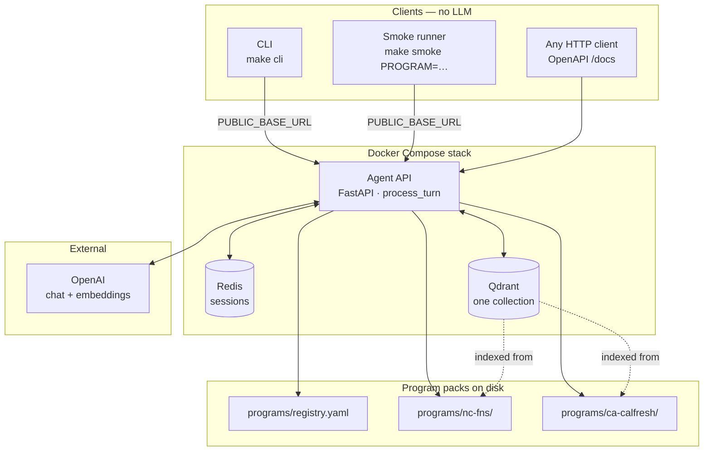
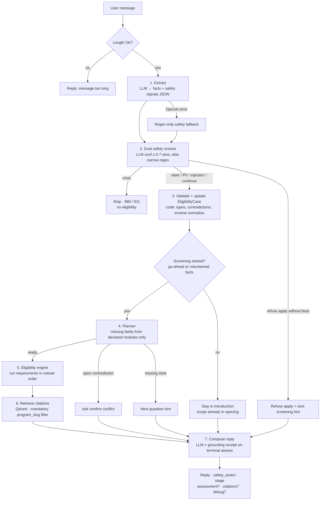
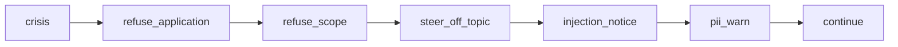
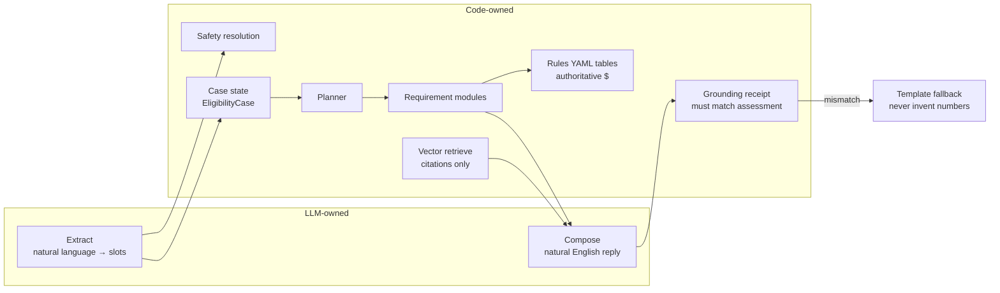
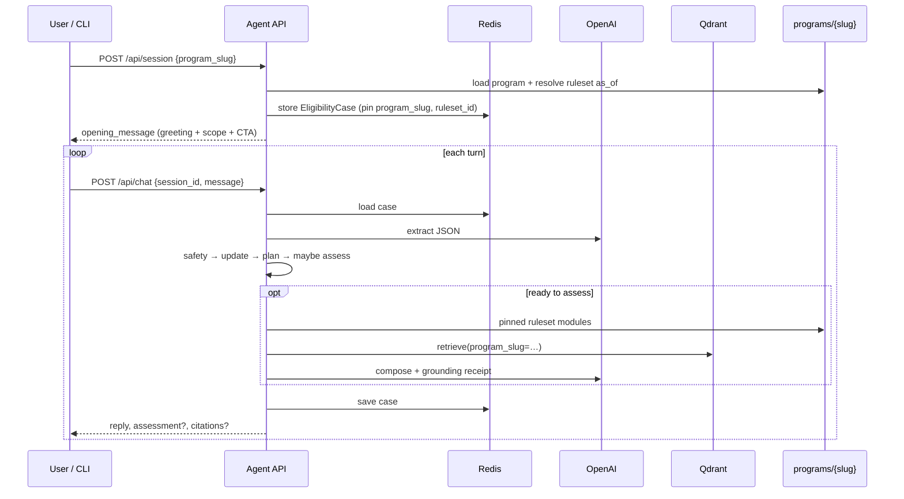
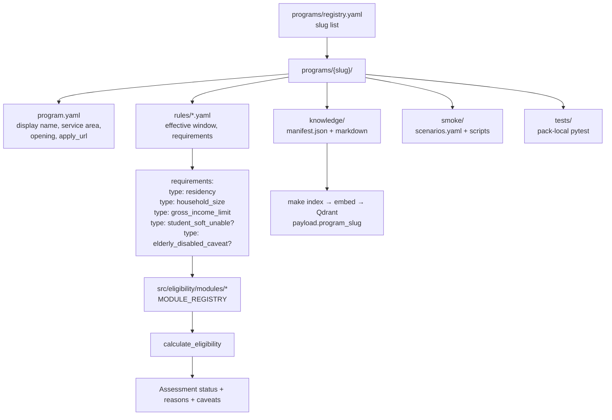
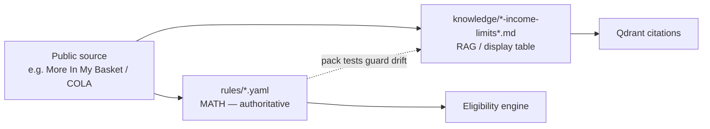
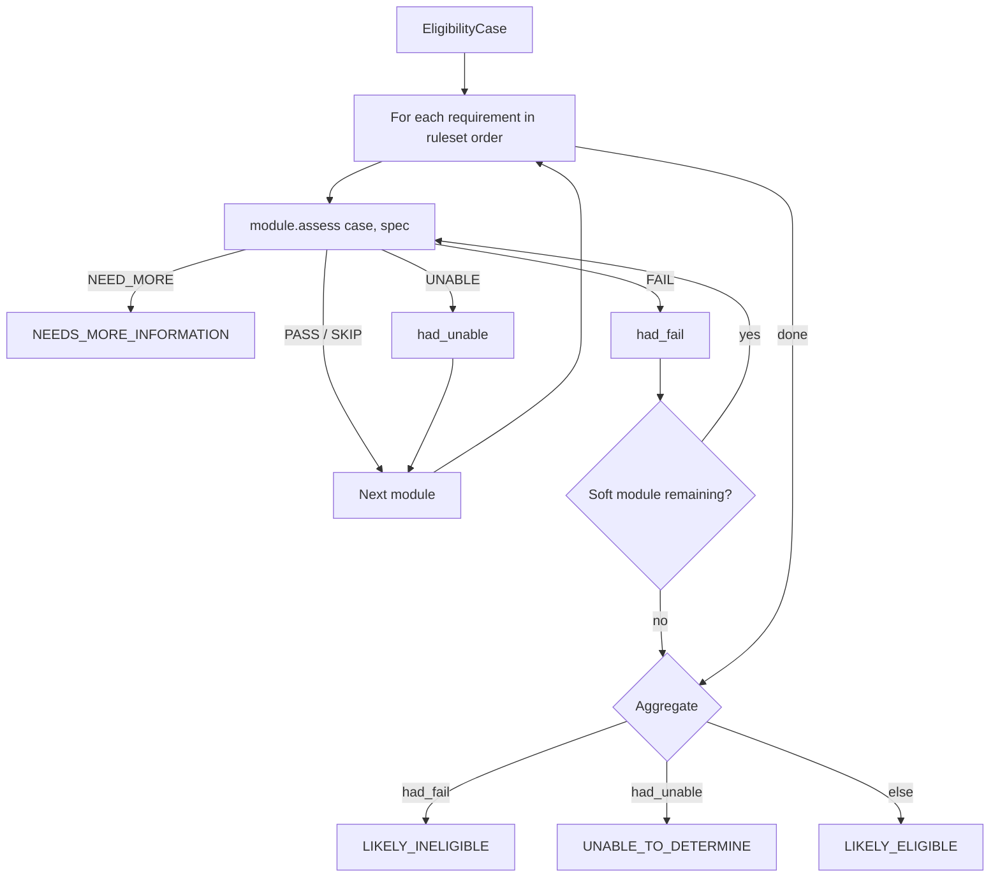
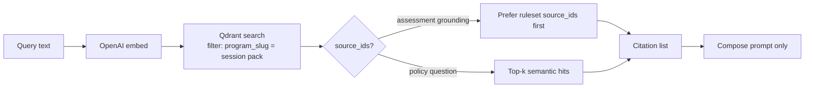
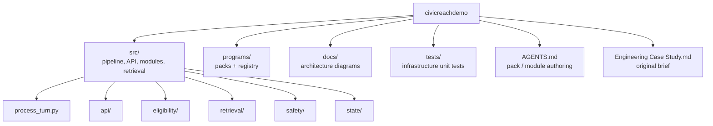

# Architecture

This document describes the **hybrid-control** design of the public-benefits eligibility agent: the LLM extracts language and composes replies; **code** owns safety, case state, planning, and eligibility math. Retrieval grounds wording and citations — it does **not** invent dollar thresholds.

> **How to view these diagrams:** see [README → Architecture diagrams](../README.md#architecture-diagrams).

---

## 1. System context (who talks to what)

Only the **agent API** runs the LLM, Redis, Qdrant, and eligibility engine. CLI and smoke are thin HTTP clients.

---

## 2. Single-turn pipeline (`process_turn`)

Fixed control flow. The model never chooses the next tool or decides eligibility status.

### Safety priority (first match wins)

---

## 3. Hybrid control (who owns what)

| Concern                       | Owner                        | Must not                            |
| ----------------------------- | ---------------------------- | ----------------------------------- |
| Dollar thresholds / pass-fail | Code + rules YAML            | Come from RAG or free-form LLM math |
| Crisis / PII / injection      | Code (dual with LLM signals) | Be silently ignored                 |
| Next question                 | Planner from modules         | Be a free-form agent tool loop      |
| Citations                     | Qdrant retrieve              | Change the assessment status        |

---

## 4. Session lifecycle

---

## 5. Program packs (multi-program without forking `src/`)

`src/` is program-agnostic. Policy, knowledge, and smoke live under `programs/{slug}/`.

### Dual copy of income thresholds (intentional)

---

## 6. Eligibility engine (declare-driven)

Only modules listed on the **pinned** ruleset run. Soft modules may still annotate after a hard fail (e.g. student / elderly caveats).

Built-in module types:

| Type                      | Role                                                            |
| ------------------------- | --------------------------------------------------------------- |
| `residency`               | Service-area hard fail                                          |
| `household_size`          | Collect / require size                                          |
| `gross_income_limit`      | Table-driven gross monthly screen; net / individual soft bounds |
| `student_soft_unable`     | Soften income pass → unable when student (no full exemptions)   |
| `elderly_disabled_caveat` | Caveat only; never flips status                                 |

---

## 7. Retrieval silo

One Qdrant collection; every query **must** pre-filter by `program_slug` so packs never cross-contaminate.

---

## 8. Repo layout (mental map)

---

## Related

- [README](../README.md) — quick start, tradeoffs, guardrails
- [Engineering Case Study](Engineering%20Case%20Study.md) — original brief
- [AGENTS.md](../AGENTS.md) — how to add a pack or module type
